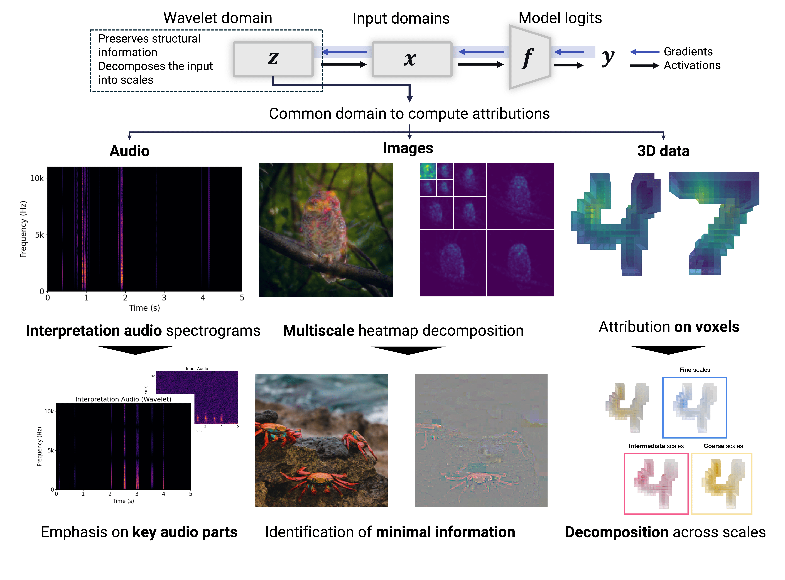

# One Wave To Explain Them All: A Unifying Perspective On Feature Attribution (ICML 2025)

Official repository for the wavelet attribution method (WAM). Project page : [https://gabrielkasmi.github.io/wam](https://gabrielkasmi.github.io/wam)


*Wavelet Attribution Method (WAM) decomposes and analyzes feature attributions across multiple frequency scales*


## Quick start

### Option 1: Run on Google Colab (Recommended)
[](YOUR_COLAB_LINK_HERE)

### Option 2: Run Locally

1. Clone the repository: `git clone https://github.com/gabrielkasmi/wam.git`
2. Install dependencies: `pip install -r requirements.txt`
3. Open `wam-example.ipynb` in Jupyter

## Environment Setup

### Prerequisites
- Python 3.8 or higher
- Conda (recommended) or pip
- CUDA-compatible GPU (optional, for faster computation)

### Quick Setup (Recommended)

**For Unix/Linux/macOS:**
```bash
git clone https://github.com/gabrielkasmi/wam.git
cd wam
./setup_env.sh
```

**For Windows:**
```cmd
git clone https://github.com/gabrielkasmi/wam.git
cd wam
setup_env.bat
```

**Using conda environment file:**
```bash
git clone https://github.com/gabrielkasmi/wam.git
cd wam
conda env create -f environment.yml
conda activate wam
```

The setup scripts will automatically:
- Create a conda environment named 'wam'
- Install PyTorch with CUDA support (if available)
- Install all required dependencies
- Verify the installation

### Manual Installation Steps

#### Option 1: Using Conda (Recommended)

1. **Clone the repository**
   ```bash
   git clone https://github.com/gabrielkasmi/wam.git
   cd wam
   ```

2. **Create and activate conda environment**
   ```bash
   conda create -n wam python=3.9
   conda activate wam
   ```

3. **Install PyTorch with CUDA support (if you have a GPU)**
   ```bash
   # For CUDA 11.8
   conda install pytorch torchvision torchaudio pytorch-cuda=11.8 -c pytorch -c nvidia
   
   # For CUDA 12.1
   conda install pytorch torchvision torchaudio pytorch-cuda=12.1 -c pytorch -c nvidia
   
   # For CPU only
   conda install pytorch torchvision torchaudio cpuonly -c pytorch
   ```

4. **Install remaining dependencies**
   ```bash
   pip install -r requirements.txt
   ```

#### Option 2: Using pip only

1. **Clone the repository**
   ```bash
   git clone https://github.com/gabrielkasmi/wam.git
   cd wam
   ```

2. **Create virtual environment**
   ```bash
   python -m venv wam_env
   source wam_env/bin/activate  # On Windows: wam_env\Scripts\activate
   ```

3. **Install PyTorch**
   ```bash
   # For CUDA support, visit https://pytorch.org/get-started/locally/ for the correct command
   pip install torch torchvision torchaudio --index-url https://download.pytorch.org/whl/cu118
   
   # For CPU only
   pip install torch torchvision torchaudio
   ```

4. **Install remaining dependencies**
   ```bash
   pip install -r requirements.txt
   ```

### Verify Installation

To verify that everything is working correctly, you can run:

```bash
python -c "import torch; import ptwt; import cv2; print('All dependencies installed successfully!')"
```

Or run the comprehensive test script:

```bash
python test_environment.py
```

This will test all dependencies and provide detailed feedback about your setup.

### Quick Start

1. **Activate your environment**
   ```bash
   conda activate wam  # or source wam_env/bin/activate
   ```

2. **Open the example notebook**
   ```bash
   jupyter notebook example.ipynb
   ```

3. **Or run the example directly**
   ```bash
   python example.py
   ```

### Project Structure

```
wam/
├── lib/                    # Core WAM implementation
│   ├── wam_1D.py          # 1D wavelet attribution method
│   ├── wam_2D.py          # 2D wavelet attribution method (images)
│   └── wam_3D.py          # 3D wavelet attribution method
├── src/                    # Supporting utilities
│   ├── dataloader.py      # Data loading utilities
│   ├── helpers.py         # Helper functions
│   ├── network_architectures.py  # Model architectures
│   └── viewers.py         # Visualization utilities
├── example.ipynb          # Interactive example notebook
├── requirements.txt       # Python dependencies
├── environment.yml        # Conda environment file
├── setup_env.sh          # Unix/Linux/macOS setup script
├── setup_env.bat         # Windows setup script
├── test_environment.py   # Environment verification script
└── README.md             # This file
```

### Troubleshooting

**Common Issues:**

1. **CUDA out of memory**: Reduce batch size in the example notebook
2. **ptwt installation issues**: Try `pip install ptwt --no-deps` and then install dependencies manually
3. **OpenCV issues**: On some systems, you might need `pip install opencv-python-headless` instead

**Getting Help:**
- Check the [issues page](https://github.com/gabrielkasmi/wam/issues) for known problems
- Create a new issue if you encounter a bug
- Check the example notebook for usage patterns

### Citation

If you use this code in your research, please cite our paper:

```bibtex
@inproceedings{
        kasmi2025WAM,
        title={One Wave To Explain Them All: A Unifying Perspective On Feature Attribution},
        author={Kasmi, Gabriel and Brunetto, Amandine and Fel, Thomas and Parekh, Jayneel},
        booktitle={Forty-second International Conference on Machine Learning},
        year={2025},
        }
```
